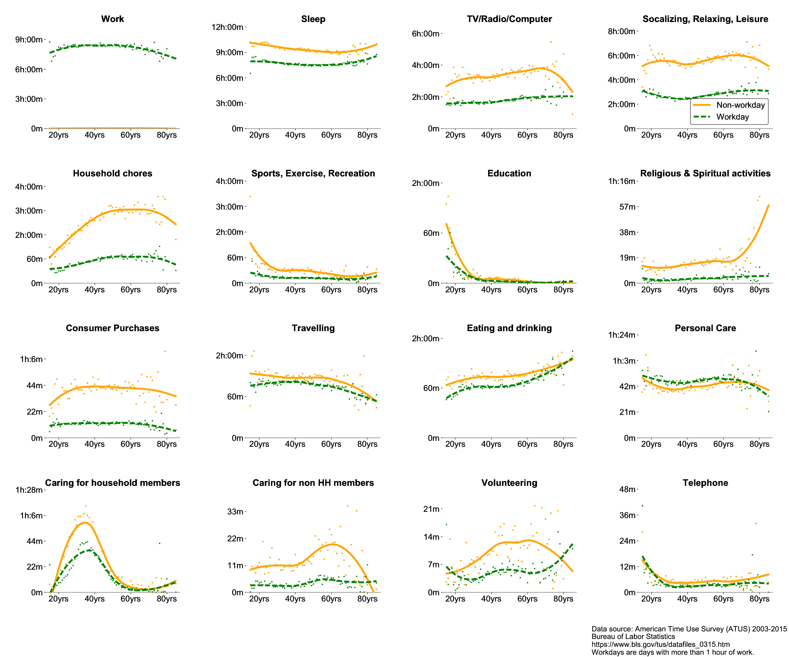
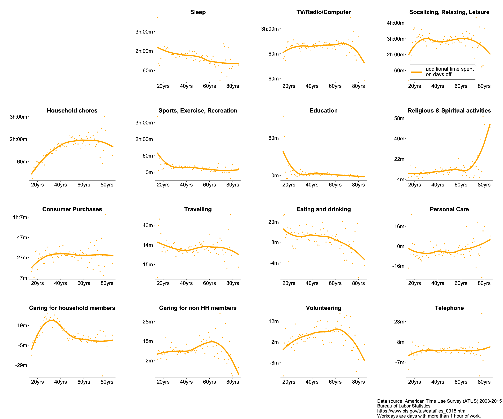

The average employee works 7.6 hours a day[^1], so this leaves plenty of 
extra time to squander on days off. But how exactly do we spend these hours?

The [American Time Use Survey](https://www.bls.gov/tus/){:target="_blank} (ATUS) is conducted annually by the U.S. Census Bureau and details the amount of time Americans 
spend doing various activities, such as work, childcare, socializing, and so forth. The data are collected by phone interviews of respondents who are asked to 
complete a 24-hour diary of activities of the day prior to the interview. The activities are extremely fine-grained and include additional information about who 
was in the room when the activity took place, where the activity took place, and many more. 
<!--more-->

For the period from 2003 to 2015, the ATUS comprises 170,843 interviews, or a little 11,000 per year (which works out to 31 interviews conducted per day). All these data 
are available from the website of the [Bureau of Labor Statistics](https://www.bls.gov/tus/){:target="_blank} and can help us to answer the question. 

The ATUS data contains some basic information about the interviewee (age, gender, employment status, etc.) and the number 
of minutes spent by him or her doing one of [433 different activities <i class="fa fa-file-pdf-o" aria-hidden="true"></i>](https://www.bls.gov/tus/lexiconnoex0315.pdf){:target="_blank}, including, for example

* Sleeping
* Socializing and communicating with others
* Providing medical care to non-household children
* Purchasing food (not groceries)
* Waiting associated with purchasing childcare 
* Travel related to participating in sports/exercise/recreation

Using some broad strokes, we can define 16 primary activities 

* Sleep
* Work
* TV/Radio/Computer
* Education
* Household chores
* Socializing/Relaxing/Leisure
* Caring for household members
* Eating and drinking
* Travelling
* Personal Care
* Sports/Excercise/Recreation
* Consumer Purchases
* Religious & Spiritual activities
* Telephone
* Caring for non-household members
* Volunteering

We select only full time employees and stratify the data by age, because what occupies us in our twenties is probably different from what we do in our sixties. Also, in order to distinguish work from non-work days, 
let's use a cutoff of 1 hour of work. Days with more than that amount of time spent working count as a workday, all others are days off. 

Here is the graph---green/dashed are workdays and orange/solid are days off (click to enlarge): 

Note the different scales on the y-axis and the noise level indicated by the scatter points. Obviously, when we work less, we sleep more and watch more TV. But we also clean up 
the house and go out and socialize. If you look at the data, you can also see the age at which we care for our kids (household members) and the age at which 
we care for our parents (non-household members). 

But back to the question from the title. Since we're actually interested in the change of time spent, let's look at the difference between work days and days off:

Here, we finally get some numbers. Again, watch the range of the y-axis. I have ordered the subplots roughly in order of decreasing total time difference. 
The "meat" so to say is in the first subgraphs. Here we can see that young employed people use the weekend to catch up on their school work, middle-aged employees focus on the weekend's household chores and the older 
you get, the more you spend that extra time from work with religious activities like going to church. Oh, and everyone sleeps and relaxes.[^2]

So, how do we spend our extra 7.6 hours on days off?[^3] The answer is 2 hours sleeping, 1 hour watching TV, 3 hours relaxing and socializing, 1.5 hours tidying, cleaning, and mowing the lawn.  

&nbsp;

&nbsp;

---

<!--  -->
##### Details of data analysis
The source code (in Julia) and the data for this analysis are available from my github repository. The data were weighted with the statistical weights as prescribed by the Bureau of Labor Statistics 
using the "tufnlwgt" column and filtered for self-described full time workers ("trdpftpt" column). Scatter points indicate raw data at each age and the smooth lines are the results of a loess filter. 
 
---

##### Footnotes
[^1]: Source: [Bureau of Labor Statistics](https://data.bls.gov/timeseries/TUU10101AA01002867){:target="_blank}
[^2]: I think this is the most surprising finding here. 
[^3]: Remember that we filtered these data for full time workers. Retired pensioners, unemployed workers, and stay-at-home parents will probably spend their time differently. 
