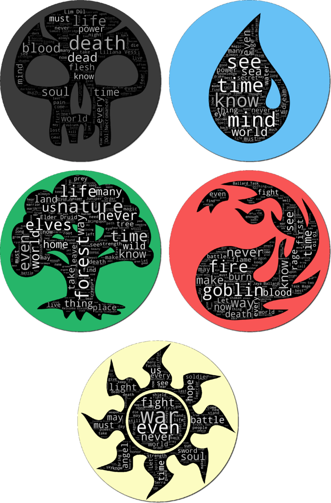

###Introduction

*Magic: The Gathering* is the grandfather of all trading card games. Set in a
magical world, it offers five factions to the player to choose from, which are
pragmatically named after one of five colors (black, green, white, blue, red).

Typical cards look like these:

If you look at the above cards, you'll notice that all of them have a small italic
portion in their text boxes. These so-called *flavor texts* are not important for the
game mechanics at all, but, like the images, only add to the look and feel of the game.

In addition, each faction has its own theme which I found summarized at [Gamepedia](http://mtg.gamepedia.com/Color):

* Blue: Knowledge, deceit, cautious, deliberate, perfecting
* Black: Power, self-interest, death, sacrifice, uninhibited
* White: Peace, law, structured, selflessness, equality
* Green: Nature, wildlife, connected, spiritual, tradition
* Red: Freedom, emotion, active, impulsive, destructive

It seems reasonable to expect that the mood of the flavor texts are related to each color's theme---
try, for example, to guess which color these flavor texts are:[^Solution]

* *Zombies mourn for the living and celebrate those who will soon be given the gift of death.*
* *"A werewolf's howl is terrifying, to be sure. But this... this was a chilling sound I somehow felt. I fear what will reply to it."*
—Alena, trapper of Kessig
* *"Barbarians! They burned my favorite chair! We'll kill them all!"* —Anje Falkenrath
* *"I came seeking a challenge. All I found was you."* —Zurgo, khan of the Mardu

Of course, some of these are more obvious than others, and it might help if you have actually played the
game a bit.

But let's see if what we can learn about a card's color from its flavor text using statistics and machine learning.

### A first look at the data

There are about 16,000
*Magic* cards in total[^1], but some of these are colorless or multi-colored. Discarding these cards
(and those without flavor texts), I collected all flavor texts of 1781 red, 1711 black, 1642 blue, 1732 green,
and 1824 white cards, which amount to a total of 8690 documents.

Here are the top five words occuring in each color's flavor text and the number of times they
appear in the word corpus of that color:

| Blue       | Black       | White      | Green       | Red          |
|------------|-------------|------------|-------------|--------------|
| mind (61)  | death (119) | even (76)  | forest (96) | fire (90)    |
| sea (59)   | life (75)   | war (73)   | nature (69) | goblins (86) |
| time (58)  | dead (73)   | life (65)  | life (66)   | goblin (58)  |
| see (54)   | blood (54)  | light (65) | elves (63)  | never (53)   |
| world (50) | would (53)  | us (63)    | world (60)  | blood (53)   |

Here, I have removed very common words (known as "stop words") such as "the", "of", "to", "a", "and", "in", etc. As one might expect,
the card creators adjust the flavor texts to the card's color and use them to create a certain mood related to each
faction's themes.
<!--- At the same time,these top words only appear on between 17% to 22% of a color's total cards. --->

A popular way to display the importance of certain words in a body of text are [word clouds](https://en.wikipedia.org/wiki/Tag_cloud).
In these images, the size of a word is adjusted to the frequency with which they occur (the font color carries no meaning).

I put them in the shape of their respective color's *mana symbol*, just because. You can download high-resolution images from here.

The word clouds contain many more words than the tabular representation above but it's easy to get a feeling for the most important
words for each color.
??Why is goblins not in the red wordcloud??

[^Solution] They're black, green, red, white.
[^1][Gamepedia] (http://mtg.gamepedia.com/Magic:_The_Gathering_statistics_and_trivia)

doublettes:
http://gatherer.wizards.com/Pages/Card/Details.aspx?multiverseid=405370
http://gatherer.wizards.com/Pages/Card/Details.aspx?multiverseid=107534
